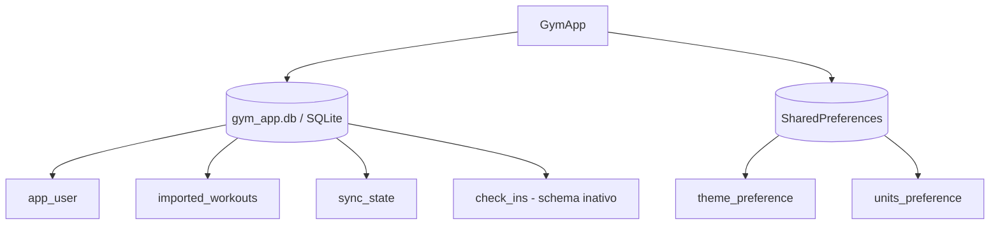

# Local Data Lifecycle & Privacy Specification

**Product baseline**: `../product-baseline/spec.md`  
**Implementation state**: SQLite e SharedPreferences locais; sem backend

## Problem Statement

O GymApp armazena dados potencialmente sensíveis de atividade física. O baseline precisa deixar claro quais dados existem, onde permanecem, como são atualizados e o que a limpeza realmente remove.

## Goals

- Definir o schema local ativo e suas responsabilidades.
- Registrar chaves, índices, retenção e regras de exclusão.
- Diferenciar SQLite de SharedPreferences.
- Explicitar ausência de transmissão/backend no MVP.
- Identificar estruturas existentes sem feature funcional.

## Storage Topology

## SQLite schema v1

### `app_user`

Perfil local com ID textual primário, nome, username, avatar opcional e timestamps. O fluxo atual mantém um usuário mock.

### `imported_workouts`

Registro canônico do workout importado. Possui:

- ID local autoincremental;
- `external_id` opcional;
- plataforma, fonte e atividade;
- intervalo/duração;
- métricas opcionais;
- notas e payload JSON opcionais;
- timestamps de importação/atualização;
- `deleted_at` para exclusão lógica.

Constraint `UNIQUE(platform, external_id)` e índices por início descendente e plataforma/ID externo. Como `external_id` aceita null, múltiplas linhas nulas não têm garantia de unicidade.

### `sync_state`

Uma linha por provider (`provider UNIQUE`) com anchor, último sucesso, última tentativa, status e erro.

### `check_ins`

Tabela com workout, user, caption, visibility e timestamps. Existe foreign key para workout, mas não há model, repository, provider, rota ou UI. Portanto é schema reservado/inativo, não feature social entregue.

## SharedPreferences

| Chave | Valores | Default | Removida por `clearAllData`? |
| --- | --- | --- | --- |
| `theme_preference` | `system`, `light`, `dark` | `system` | Não |
| `units_preference` | `metric`, `imperial` | `metric` | Não |

## Criação e migração

- Arquivo: `gym_app.db` no path fornecido pelo `DatabaseFactory` injetado.
- Versão: 1.
- Todas as tabelas/índices são criados em `onCreate`.
- Não existe `onUpgrade`, estratégia de migração ou export/import de banco.
- A factory pode ser substituída, permitindo SQLite FFI em testes.

## Retenção e exclusão

- Workouts permanecem até limpeza total ou futura lógica de exclusão ainda inexistente.
- Consultas de feed/histórico ignoram `deleted_at` não nulo; detalhe por ID não ignora.
- Sync state permanece por provider entre execuções.
- Perfil mock permanece até limpeza e é imediatamente recriado após ela.
- `clearAllData` executa uma única transação e apaga tabelas na ordem `check_ins`, workouts, sync state, user.
- Preferências sobrevivem à limpeza do banco.

## Privacidade e rede

O baseline não inclui pacote HTTP, cliente de backend, endpoint remoto, analytics, upload ou sincronização em nuvem. Workouts, metadata bruta, perfil e sync state permanecem no armazenamento local controlado pelo app/OS.

HealthKit é uma dependência local do dispositivo: o app lê dados autorizados e persiste uma cópia no SQLite. `rawPayload` pode conter bundle identifier, source name, device name e metadata convertida para string; em debug esse JSON pode ser exibido na tela de detalhes.

“Local-only” descreve a implementação atual, não uma garantia criptográfica: o banco não possui criptografia aplicada pelo código e pode estar sujeito aos mecanismos de backup/proteção padrão do sistema operacional.

## Critérios de aceite

### P1 — Integridade local

1. WHEN o banco é criado pela primeira vez THEN o sistema SHALL criar as quatro tabelas e os dois índices definidos no schema v1.
2. WHEN um `DatabaseFactory` é injetado THEN path e abertura do banco SHALL usar a mesma factory.
3. WHEN existe `external_id` repetido na mesma plataforma THEN a persistência SHALL atualizar a linha existente em vez de inserir uma segunda.
4. WHEN o mesmo `external_id` existe em plataformas diferentes THEN cada plataforma SHALL manter sua própria linha.
5. WHEN `external_id` é nulo THEN o sistema não SHALL prometer deduplicação.
6. WHEN sync state é salvo novamente para o mesmo provider THEN o repository SHALL atualizar a linha existente.

### P1 — Visibilidade e retenção

1. WHEN `deleted_at` é não nulo THEN feed e histórico SHALL omitir o workout.
2. WHEN o workout soft-deleted é consultado diretamente por ID THEN o baseline SHALL retorná-lo; essa exceção deve permanecer documentada até correção.
3. WHEN o app reinicia THEN banco e preferências SHALL ser reutilizados do armazenamento local.
4. WHEN payload bruto existe THEN o sistema SHALL persistir JSON e somente SHALL exibi-lo em debug.

### P1 — Limpeza

1. WHEN `clearAllData` é chamado THEN as quatro tabelas SHALL ser apagadas dentro de uma transação.
2. WHEN qualquer delete da transação falha THEN a transação SHALL não concluir parcialmente.
3. WHEN a ação de Settings conclui THEN o sistema SHALL recriar o usuário mock.
4. WHEN o banco é limpo THEN SharedPreferences SHALL permanecer intacto.

### P2 — Limites de privacidade

1. WHEN o MVP opera normalmente THEN o código SHALL não transmitir os registros a backend, pois nenhum backend existe.
2. WHEN HealthKit é autorizado THEN o bridge SHALL solicitar leitura sem tipos de compartilhamento.
3. WHEN um build release mostra detalhe THEN `rawPayload` SHALL permanecer oculto pela condição `kDebugMode`.

## Edge Cases e riscos

- Não há migração após schema v1; alterar tabelas exige design/migration futura.
- O código não habilita explicitamente `PRAGMA foreign_keys = ON`; a FK de check-in pode não ser aplicada dependendo da configuração do SQLite.
- Sem criptografia no nível do app.
- `rawPayload` é flexível e pode crescer; não há limite de tamanho.
- Histórico não possui paginação/retenção automática.
- A limpeza não usa confirmação na UI e não é reversível pelo app.
- Soft delete está no modelo/schema, mas não há comando para defini-lo.

## Evidência e cobertura automatizada

| Área | Evidência | Cobertura atual |
| --- | --- | --- |
| Schema/índices/clear | `AppDatabase` | FFI abre/limpa banco no setup do teste de upsert |
| Factory injetada | `AppDatabase` | `local_workout_upsert_test.dart` depende da factory FFI |
| Unicidade/upsert | `LocalWorkoutDataSource` | duplicata mesma plataforma/ID coberta |
| Filtros soft delete | `LocalWorkoutDataSource` | sem teste dedicado |
| Sync state | `LocalSyncStateRepository` | sem teste dedicado |
| Preferências | `SettingsController` | sem teste dedicado |
| Privacidade/ausência de rede | `pubspec.yaml`, ausência de clientes/serviços remotos | revisão estática, não teste executável |

## Requirement Traceability

| ID | Requisito | Implementação | Estado documental |
| --- | --- | --- | --- |
| DATA-01 | Schema SQLite v1 e índices | `AppDatabase` | Documented |
| DATA-02 | Factory injetável consistente | `AppDatabase` | Documented |
| DATA-03 | Unicidade/upsert de workouts | `LocalWorkoutDataSource` | Documented |
| DATA-04 | Estado por provider | `LocalSyncStateRepository` | Documented |
| DATA-05 | Limpeza transacional | `AppDatabase.clearAllData` | Documented |
| DATA-06 | Preferências fora da limpeza | `SettingsController` | Documented |
| DATA-07 | Local-only e payload debug | `pubspec.yaml`, `WorkoutDetailScreen` | Documented |
| DATA-08 | Schema inativo e riscos explícitos | esta spec | Documented |

**Open questions**: nenhuma para o baseline. Criptografia, backups, retenção, migrações e export/delete granular exigem requisitos de produto e threat model próprios.

