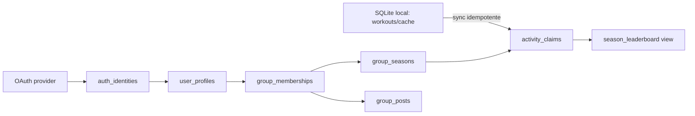

# PostgreSQL Social Schema Design

**Spec:** `spec.md`

## Boundary

SQLite continua dono de `ImportedWorkout`, sync state e cache local. PostgreSQL é dono de identidade, grupos, membership, temporadas/regras, claims auditáveis, placar, fauna social e mural. Nenhuma migration move dados pessoais locais automaticamente.

## Decisions

- A migration usa o schema `gymapp` e `pgcrypto` para UUIDs, sem exigir extensão de terceiros.
- A regra é um snapshot na temporada: métrica, limites, fontes, timezone e vigência. Um trigger bloqueia editar campos de pontuação após o primeiro claim.
- O trigger de claim calcula status e crédito no banco para impedir que um cliente manipule ranking. Valor bruto sempre permanece disponível para transparência.
- Idempotência é uma chave parcial `(season, member, source, source_reference)`; uma sincronização repetida falha sem duplicar pontos.
- A view de ranking usa `total_credited DESC`, depois o instante da primeira pontuação que atingiu o total e o ID como desempate estável.
- RLS usa `SET LOCAL app.user_id = '<uuid>'` pela API em toda transação. Um backend privilegiado pode executar migrações, mas clientes não devem usar essas credenciais.

## Risks and mitigations

| Risk | Mitigation |
| --- | --- |
| Sem fornecedor de auth definido | `auth_identities` usa contrato neutro provider/subject; nenhum JWT específico é persistido. |
| Concorrência no teto diário | trigger bloqueia a linha da temporada com `FOR UPDATE` antes de contar claims. |
| RLS recursivo em memberships | funções `SECURITY DEFINER` consultam apenas o mínimo necessário e fixam `search_path`. |
| Fotos grandes no banco | apenas `storage_key` e metadados são armazenados. |
| Alterar uma regra retroativamente | trigger impede mutação depois do primeiro claim. |

## Migration order

1. tipos, schema e helpers;
2. identidade, grupos e temporadas;
3. claims, fauna e view de ranking;
4. mural, moderação e RLS;
5. scripts e smoke test executados externamente.
