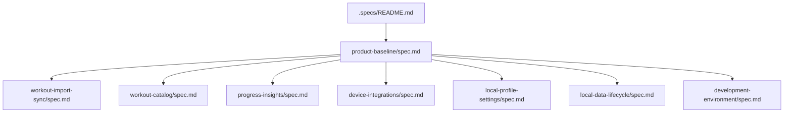

# Product Baseline Documentation Design

**Spec**: `.specs/features/product-baseline/spec.md`  
**Status**: Approved by execution request

## Abordagens consideradas

| Abordagem | Vantagens | Limitações |
| --- | --- | --- |
| Uma única spec monolítica | Busca simples em um arquivo | Mistura domínios, cresce mal e dificulta evolução independente |
| Uma spec por tela | Correspondência direta com UI | Duplica regras compartilhadas e acopla requisito à apresentação atual |
| **Visão canônica + specs por domínio** | Separa produto, regras e integrações; mantém rastreabilidade | Exige índice e disciplina de links |

**Escolha**: visão canônica + specs por domínio. É compatível com a arquitetura feature-first de AD-003 e permite que novas features alterem um domínio sem reescrever todo o baseline.

## Arquitetura da documentação

## Convenções

- Cada spec funcional descreve comportamento observável, estados, erros, limites, dados e evidência no código.
- `Implementado`, `Implementado parcialmente`, `Preview`, `Planejado` e `Fora do escopo` são estados distintos.
- Critérios usam `WHEN/THEN/SHALL` e não elevam TODOs ou schemas inativos a features entregues.
- Caminhos de código são evidência de implementação; testes existentes são citados separadamente como cobertura automatizada.
- Requisitos recebem prefixo estável por domínio: `SYNC`, `WORK`, `PROG`, `DEV`, `SET`, `DATA` e `PROD`.
- Specs de novas features devem referenciar e, quando necessário, superseder explicitamente o baseline correspondente.

## Reuso e fontes de verdade

| Fonte | Uso |
| --- | --- |
| `README.md` | Intenção original do MVP e vertical slice |
| `lib/core/router/app_router.dart` | Rotas e superfícies existentes |
| `lib/core/config/app_providers.dart` | Orquestração e estado |
| `lib/features/**` | Regras por domínio |
| `lib/core/database/app_database.dart` | Schema e ciclo de vida local |
| `ios/Runner/AppDelegate.swift` | Contrato HealthKit nativo |
| `test/**` | Evidência automatizada e lacunas |
| `.specs/STATE.md` | Decisões arquiteturais vigentes |

## Estratégia de verificação

1. links e seções obrigatórias presentes;
2. cada capability claim ancorada em símbolo/arquivo existente;
3. estados atuais confrontados com código e testes, sem inferir comportamento não entregue;
4. gates Flutter (`analyze` e `test`) para comprovar que não houve alteração acidental de código.

O discrimination sensor alterará em cópia temporária um estado documental de `Planejado` para `Implementado`; a revisão independente deverá detectar a contradição com o código.

## Riscos & Concerns

| Concern | Evidência | Impacto | Mitigação documental |
| --- | --- | --- | --- |
| Preferência imperial não é aplicada | `SettingsController` salva `AppUnits`; `Formatters` não recebe a preferência | UI pode sugerir suporte maior que o real | Marcar como implementação parcial |
| Heart rate não é agregado pelo HealthKit | comentário em `AppleHealthService.serializeWorkout` | Campos chegam nulos do iOS atual | Registrar diferença entre modelo e integração |
| Health Connect e Garmin são placeholders | TODOs em `DeviceIntegrationRepositoryImpl` | Risco de serem descritos como prontos | Estado `Planejado` obrigatório |
| `check_ins` possui apenas tabela | schema sem repository/provider/UI | Risco de falsa feature social | Classificar como schema inativo |
| Cobertura automatizada é estreita | apenas 3 testes | Regras de UI/sync não têm prova executável | Separar evidência de código de cobertura automatizada |
| Sync concorrente não tem exclusão explícita | startup/resume/manual convergem em `SyncController` | Corridas são possíveis | Registrar como limitação |

## Decisões técnicas

| Decisão | Escolha | Racional |
| --- | --- | --- |
| Unidade de decomposição | domínio funcional, não tela | Regras de persistência/sync atravessam telas |
| Linguagem | português com identificadores técnicos originais | Precisão e legibilidade |
| Estado do roadmap | informativo e não comprometido | Não confundir placeholder com entrega confirmada |
| Evidência | arquivo/símbolo e teste quando existir | Mais estável que números de linha |

