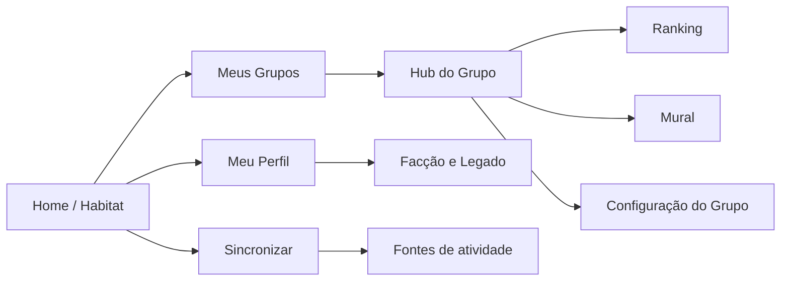

# Fauna Social & Gamification — Product Design

**Spec:** `.specs/features/social-gamification-roadmap/spec.md`
**Status:** draft — pronto para transformação em plano técnico após autorização de desenvolvimento.

## Estratégia recomendada

Evoluir o produto em camadas, mantendo o histórico individual offline-first e acrescentando uma camada remota somente para identidade, grupos, ranking e conteúdo social. Essa abordagem preserva o valor atual do app quando offline e evita que a primeira entrega social dependa de reescrever importação, SQLite e progresso.

| Abordagem | Vantagem | Limitação | Decisão |
| --- | --- | --- | --- |
| Reescrever tudo como app remoto | Modelo único de dados | Alto risco; interrompe o MVP local já funcional | Rejeitada |
| Offline-first + social remoto | Reaproveita importação local e cria grupos gradualmente | Exige sincronização e regras idempotentes | **Recomendada** |
| Gamificação apenas local | Entrega visual rápida | Não entrega grupo, ranking ou mural | Fase 0, não produto final |

## Navegação proposta

## Linguagem visual

- **Home chama-se Habitat**: o lugar onde a pessoa vê seu mascote, Forma e próximo tier.
- O mascote é grande, expressivo e muda em três estados: ativo, em recuperação e pronto para evoluir.
- A cor da facção é um acento, não substitui informações textuais: Leão usa dourado/solar; Dragão usa violeta/fogo.
- Tiers nunca são apenas cor; sempre exibem ícone, espécie e texto.
- Todo score social informa unidade, origem e limite aplicado para evitar ranking opaco.

## Telas e funções

### 1. Habitat — Home

**Objetivo:** tornar o retorno ao app emocional e acionável.

- Mascote do animal atual em destaque; nome do tier e facção.
- Barra de Forma atual e cartão de Legado anual.
- Mensagem contextual: `Faltam 18 pontos para Urso` ou `Seu Urso está em recuperação`.
- Botão primário `Sincronizar agora`; segundo CTA para abrir o grupo mais ativo.
- Resumo de posição no ranking, última atividade e missão semanal quando existir.
- Estado sem grupo: convite para criar ou entrar em grupo; estado sem fonte: banner não bloqueante para conectar fonte ou fazer check-in onde permitido.

### 2. Fontes e sincronização

**Objetivo:** explicar de onde vem cada atividade e evitar dependência de hardware.

- Apple Health, Health Connect, Garmin futuro e origem manual/social aparecem separadamente.
- Cada fonte mostra conexão, último sync e atividades importadas.
- `Sincronizar agora` continua sendo a principal ação de baixo atrito.
- Explicação clara: grupos podem aceitar treino sincronizado, check-in ou publicação de acordo com suas regras.

### 3. Meu perfil

**Objetivo:** reunir identidade e evolução pessoal.

- Mascote, tier, facção, Forma, Legado e melhor tier anual.
- Heatmap/calendário de consistência, gráfico de atividades e marcos de evolução.
- Lista de grupos, conquistas e posts recentes.
- Versão pública limitada para membros do mesmo grupo; dados de saúde brutos não são expostos.

### 4. Meus grupos

**Objetivo:** entrada rápida na comunidade certa.

- Cards com ícone, nome, temporada, regra de pontuação, posição do usuário e atividade recente.
- Ações `Criar grupo` e `Entrar com convite`.
- Filtros simples: ativos, encerrados e convites pendentes.

### 5. Criar grupo

**Objetivo:** criar uma competição clara sem configuração técnica.

Passos do wizard:

1. Nome, imagem, descrição e timezone.
2. Privacidade e convite.
3. Métrica: workouts, minutos, quilômetros ou posts/check-ins.
4. Limites: mínimo/máximo por atividade e máximo por dia; a UI explica o efeito com exemplo.
5. Fontes aceitas: sincronizado, check-in/publicação ou ambos.
6. Data de início/fim, resumo de regra e confirmação.

O dono vira moderador inicial. Após primeira atividade elegível, mudança de métrica ou limites cria a próxima temporada em vez de mudar placar existente.

### 6. Hub do grupo

**Objetivo:** concentrar ranking, conversa e regra em uma superfície.

- Cabeçalho com nome, temporada, contagem regressiva e regra resumida.
- Abas `Ranking`, `Mural`, `Membros` e `Sobre`.
- CTA contextual: sincronizar, publicar check-in ou convidar membro.
- Cartão de contribuição pessoal: pontos, unidade bruta, limite restante do dia e próximo adversário.

### 7. Ranking

**Objetivo:** transformar score em motivação, sem esconder regras.

- Lista ordenada com posição, mascote, nome, tier, pontos e métrica bruta.
- A linha do próprio usuário fica sempre visível quando está fora da dobra.
- Etiquetas mostram `sincronizado`, `check-in` ou `post`, conforme a origem que gerou a atividade mais recente.
- Cabeçalho exibe métrica, limites e desempate; tocar abre explicação da regra.
- Perfil de membro mostra conquistas e contribuição no grupo, não payload de saúde.

### 8. Mural do grupo

**Objetivo:** produzir accountability tipo fórum, não conversa vazia.

- Feed cronológico com posts de atividade, check-in e conversa.
- Post de atividade mostra mascote, fonte, pontuação creditada e mensagem opcional.
- Post comum aceita texto e foto opcional; comentários e reações ficam visíveis no card.
- Posts fixados aparecem no topo; moderadores podem fixar e remover conteúdo no escopo do grupo.
- Composer oferece `Compartilhar atividade`, `Check-in` e `Conversa` de forma explícita.

### 9. Facção e Legado

**Objetivo:** materializar a meta longa de se tornar Leão ou Dragão.

- Mostra escolha atual, narrativa curta da facção e progresso até o tier máximo.
- Mostra Legado anual, melhor Forma, temporadas concluídas e marcos.
- Em fase posterior, abriga disputa global Leões versus Dragões; antes disso, evita ranking global vazio.

### 10. Entrada, login e onboarding (P2)

**Objetivo:** converter sem bloquear o valor local já existente.

- Tela de boas-vindas explica `sincronize, evolua, pertença`.
- Login por Google, Microsoft e Apple é obrigatório apenas ao criar/entrar/publicar em grupo.
- Banner de fontes explica o benefício do relógio/app fitness, mas oferece alternativa de check-in se a regra permitir.
- Escolha de facção é visual e confirmada antes de entrar na primeira temporada.

## Contratos de produto

| Conceito | Campos essenciais | Regra |
| --- | --- | --- |
| GroupRule | métrica, mínimo, máximo, teto diário, fontes aceitas, timezone | Versão imutável durante temporada ativa. |
| ActivityClaim | origem, valor bruto, valor creditado, timestamp, membro, grupo | Deduplicada por origem/ID; transparente no ranking. |
| Season | grupo, regra versionada, início/fim, ranking congelável | Encerra sem recalcular temporadas passadas. |
| FaunaRank | tier, facção, Forma, Legado, marcos | Forma pode cair; Legado só acumula no ano. |
| GroupPost | tipo, autor, atividade opcional, texto/foto, fixado | Visibilidade limitada ao grupo. |

## Estados e regras de pontuação

1. Uma atividade é sempre armazenada como evento, mesmo quando não gera ponto.
2. O cálculo aplica: fonte aceita → mínimo → máximo por evento → teto diário → regra da temporada.
3. A tela sempre exibe valor bruto e valor creditado quando forem diferentes.
4. Posts/check-ins só pontuam se o modo/fonte do grupo os aceitar; não fingem ser dados de wearable.
5. Empate usa a primeira atividade que atingiu a pontuação final; a regra aparece no ranking.
6. Operações remotas devem ser idempotentes por `group + member + source + externalId/postId`.

## Reuso do baseline atual

| Existente | Reuso no roadmap |
| --- | --- |
| `ImportedWorkout`, SQLite e upsert | Fonte local de atividades sincronizadas e histórico individual. |
| `FitnessImportRepositoryImpl` | Gatilho de criação de ActivityClaim após sync remoto ser introduzido. |
| `SyncStateRecord` | Transparência de última sincronização na tela Fontes. |
| Riverpod e feature-first | Fronteira para novos domínios `identity`, `groups`, `gamification` e `social`. |
| `check_ins` schema inativo | Não reutilizar cegamente; revisar/migrar antes de representar check-in social. |

## Riscos e mitigações

| Risco | Impacto | Mitigação |
| --- | --- | --- |
| Ranking só com wearable exclui usuários | Comunidade pequena e injusta | Grupo escolhe fontes e modo `posts/check-ins`. |
| Score ilimitado incentiva spam/overtraining | Ranking perde confiança e pode estimular comportamento ruim | Mínimo/máximo/teto diário por grupo, transparência e descanso sem punição extrema. |
| Ausência derruba motivação | Usuário abandona após alguns dias | Separar Forma móvel de Legado anual permanente. |
| Chat aumenta moderação e custo | MVP social fica grande demais | Começar por mural moderável e privado. |
| Modelo atual é local-only | Grupos não podem ser consistentes entre aparelhos | Escolher backend e contratos de sincronização antes da fase 1. |
| `check_ins` atual não possui domínio/UI | Reuso incorreto e migrações frágeis | Criar modelo social explícito e planejar migração. |

## Decisões técnicas ainda pendentes

- Escolher backend de auth, banco remoto, storage de fotos, autorização por grupo e notificações.
- Definir limites numéricos de tiers e curvas de Forma/Legado por telemetria e playtest.
- Definir política de moderação, denúncia, retenção de fotos e exclusão de conta.
- Definir provas adicionais opcionais (foto, localização, fonte) sem excluir participação básica.
