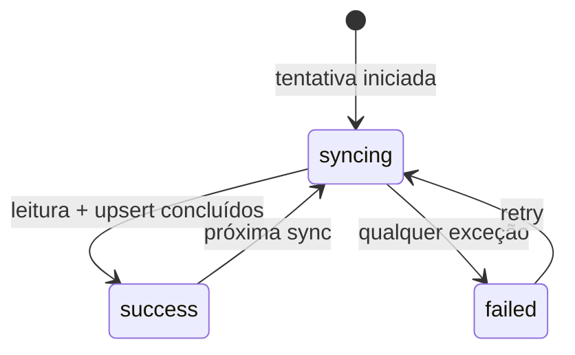

# Workout Import & Synchronization Specification

**Product baseline**: `../product-baseline/spec.md`  
**Implementation state**: Apple Health implemented on iOS; preview implemented elsewhere

## Problem Statement

Workouts are produced outside GymApp. The synchronization flow must import them into the local model, remain repeatable, preserve useful state after failures and provide a demonstrable fallback when HealthKit cannot run.

## Goals

- Import workout-level data from HealthKit through the native iOS bridge.
- Support startup, foreground-resume and manual synchronization.
- Make repeat imports idempotent when the platform supplies an external ID.
- Persist sync status and anchor per provider.
- Use explicit preview data when HealthKit is unavailable.

## Out of Scope

| Item | Estado/motivo |
| --- | --- |
| Health Connect e Garmin | Integrações planejadas, não implementadas |
| Background fetch do sistema operacional | Não existe scheduler/background task no baseline |
| Escrita no Apple Health | Autorização usa `toShare: nil` |
| Agregação de frequência cardíaca | Adiada no bridge nativo |
| Exclusões vindas do HKAnchoredObjectQuery | O callback ignora `deletedObjects` atualmente |

## Gatilhos

| Gatilho | Origem | Comportamento |
| --- | --- | --- |
| Startup | `bootstrapProvider` | Garante usuário mock e tenta sync; falha vira banner sem bloquear a navegação |
| Resume | `GymApp.didChangeAppLifecycleState` | Chama sync com `manual: false` |
| Botão `Sync now` | `DevicesScreen` | Chama sync manual e atualiza providers |
| Retry do banner | `GymApp.builder` | Repete sync após falha de startup |
| Conectar Apple Health | `SyncController.connectAppleHealth` | Solicita autorização; não importa por si só |

## Máquina de estados

Cada tentativa registra `lastAttemptedSyncAt`. Sucesso registra `lastSuccessfulSyncAt`, novo anchor quando fornecido e limpa a mensagem de erro. Falha preserva o último sucesso e o anchor anterior, grava `errorMessage` e relança a exceção.

## Contrato HealthKit

O Flutter usa o canal `com.gymapp.health/apple_health` com os métodos:

| Método | Resultado |
| --- | --- |
| `isHealthDataAvailable` | booleano de disponibilidade |
| `requestAuthorization` | booleano ou `authorization_failed` |
| `getAuthorizationStatus` | `notDetermined`, `sharingDenied`, `authorized`, `unknown` ou `unavailable` |
| `syncWorkouts` | workouts dos últimos 90 dias + anchor |
| `syncWorkoutsSince` | delta desde o anchor decodificado + novo anchor |
| `getRecentWorkouts` | query recente de 30 dias; não usada pelo fluxo Flutter atual |

A autorização solicita leitura de workouts, energia ativa, distância de caminhada/corrida, distância de ciclismo e heart rate. Nenhum tipo é solicitado para escrita.

## Seleção da fonte

1. Se o provider é Apple Health e `AppleHealthDataSource.isAvailable()` retorna `true`, usar HealthKit.
2. Em qualquer outro caso no repositório atual, usar `MockFitnessDataSource.syncPreviewWorkouts()`.
3. O preview produz exatamente dois workouts com IDs `mock-workout-1` e `mock-workout-2`, fontes distintas e anchor temporal `mock-anchor-*`.

Essa regra permite demonstração, mas também significa que chamar sync com provider ainda não implementado cairia no preview; a UI atual só dispara Apple Health.

## Mapeamento e persistência

O payload da plataforma é convertido para `ImportedWorkout`:

- datas são parseadas e convertidas para UTC;
- `activityType` é normalizado para lowercase;
- métricas numéricas permanecem opcionais;
- payload desconhecido é preservado em `rawPayload`;
- `importedAt` e `updatedAt` são definidos no momento do mapeamento.

No upsert:

- com `externalId`, buscar por `platform + external_id`;
- se encontrado, atualizar a mesma linha, preservar `id` e `importedAt`, renovar `updatedAt`;
- se não encontrado, inserir;
- sem `externalId`, sempre inserir e não prometer deduplicação.

## Critérios de aceite

### P1 — Sincronização nativa ou preview

1. WHEN a primeira sync HealthKit ocorre sem anchor THEN o sistema SHALL consultar workouts com início nos últimos 90 dias e retornar um anchor serializado.
2. WHEN existe anchor válido THEN o sistema SHALL chamar `syncWorkoutsSince` e usar o anchor decodificado na query ancorada.
3. WHEN o anchor não pode ser decodificado THEN o bridge SHALL tratá-lo como ausência de anchor, sem falhar somente por isso.
4. WHEN HealthKit está indisponível THEN o sistema SHALL importar os dois workouts de preview e marcar a conexão como preview.
5. WHEN uma lista vazia é retornada THEN o sistema SHALL concluir com sucesso, `importedCount = 0` e atualizar o estado de sync.

### P1 — Idempotência e estado

1. WHEN um workout com mesmo `platform + externalId` é sincronizado novamente THEN o sistema SHALL manter uma linha e aplicar as métricas mais recentes.
2. WHEN o update ocorre THEN o sistema SHALL preservar o `importedAt` original e definir novo `updatedAt` UTC.
3. WHEN a tentativa começa THEN o estado SHALL ser `syncing`, sem apagar anchor e último sucesso existentes.
4. WHEN a tentativa termina com sucesso THEN o estado SHALL ser `success`, sem `errorMessage`.
5. WHEN a tentativa lança exceção THEN o estado SHALL ser `failed`, conter `error.toString()` e preservar anchor/último sucesso.

### P2 — Recuperação observável

1. WHEN sync de bootstrap falha THEN a navegação SHALL carregar e um banner SHALL oferecer `Retry sync` e `Dismiss`.
2. WHEN bootstrap estrutural falha fora do bloco recuperável de sync THEN a aplicação SHALL exibir `GymApp could not finish startup.` e `Retry`.
3. WHEN sync manual falha THEN `SyncController` SHALL expor AsyncError e `DevicesScreen` SHALL renderizar `Sync error: ...`.

## Edge Cases e limitações

- O repositório não possui exclusão mútua; triggers simultâneos podem iniciar syncs concorrentes.
- Objetos removidos retornados pelo HealthKit não são processados.
- O lookback de 90 dias continua aplicado mesmo com anchor.
- A disponibilidade HealthKit captura `PlatformException` e retorna `false`, ativando preview.
- Erros de `syncWorkouts` não são convertidos em preview; são persistidos como falha.
- `manual` está no contrato, mas não altera a lógica interna atual.

## Evidência e cobertura automatizada

| Comportamento | Evidência | Cobertura automatizada atual |
| --- | --- | --- |
| Payload -> workout | `ImportedWorkout.fromPlatformPayload` | `test/workout_mapping_test.dart` |
| Deduplicação/update | `LocalWorkoutDataSource.upsertWorkouts` | `test/local_workout_upsert_test.dart` |
| Estado success/failed | `FitnessImportRepositoryImpl.sync` | Sem teste dedicado |
| Bridge/anchor/autorização | `ios/Runner/AppDelegate.swift` | Sem teste dedicado |
| Triggers startup/resume/manual | `main.dart`, `app_providers.dart`, `devices_screen.dart` | Sem widget/integration test |

## Requirement Traceability

| ID | Requisito | Implementação | Estado documental |
| --- | --- | --- | --- |
| SYNC-01 | Startup/resume/manual sync | `main.dart`, `app_providers.dart` | Documented |
| SYNC-02 | HealthKit bridge e autorização read-only | `AppDelegate.swift`, `AppleHealthDataSource` | Documented |
| SYNC-03 | Preview fallback | `MockFitnessDataSource` | Documented |
| SYNC-04 | Mapping UTC e payload | `ImportedWorkout.fromPlatformPayload` | Documented |
| SYNC-05 | Upsert idempotente com ID externo | `LocalWorkoutDataSource.upsertWorkouts` | Documented |
| SYNC-06 | Estado e recuperação de falhas | `FitnessImportRepositoryImpl.sync` | Documented |
| SYNC-07 | Limitações e gaps de teste explícitos | esta spec | Documented |

**Open questions**: nenhuma para o baseline. Concorrência, deleções ancoradas e background sync exigem specs futuras antes de implementação.

